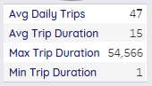
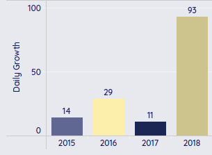

# Análisis Exploratorio del Programa de Bicicletas Compartidas Citi Bike

Este proyecto se enfoca en realizar un análisis exploratorio del programa de bicicletas compartidas Citi Bike. A través de este análisis, buscamos entender los patrones de uso, identificar tendencias históricas y proporcionar recomendaciones para la toma de decisiones estratégicas.

## Índice

1. [Objetivos](#objetivos)
2. [Herramientas](#herramientas)
3. [Lenguajes](#lenguajes)
4. [Preparación de Datos](#preparación-de-datos)
   - [Revisión de nulos](#revisión-de-nulos)
   - [Revisión de duplicados](#revisión-de-duplicados)
   - [Transformación de variables](#transformación-de-variables)
5. [Métricas Calculadas](#métricas-calculadas)
   - [Métricas diarias](#métricas-diarias)
   - [Métricas históricas](#métricas-históricas)
   - [Crecimiento Diario de Viajes](#crecimiento-diario-de-viajes)
6. [Conclusiones Generales](#conclusiones-generales)
7. [Recomendaciones para el Nuevo CEO](#recomendaciones-para-el-nuevo-ceo)
8. [Dashboard](#dashboard)
9. [Presentación](#presentacionS)

## Objetivos

1. **Métricas de uso en un día promedio**
    - **Número promedio de viajes diarios:** Determinar cuántos viajes se realizan en un día promedio.
    - **Estadísticas descriptivas de la duración de los viajes:** Calcular el valor máximo, mínimo, promedio, y la desviación estándar de la duración de los viajes en minutos.

2. **Métricas históricas del servicio**
    - **Total de viajes:** Calcular el número total de viajes realizados durante el periodo de análisis.
    - **Crecimiento del número de viajes diarios:** Analizar cómo ha cambiado el número de viajes diarios a lo largo del tiempo.
    - **Desglose de viajes por perfil de usuario:** Desglosar los viajes por género, edad y tipo de suscripción para identificar patrones de uso.

3. **Descubrimiento de patrones y tendencias**
    - **Patrones de uso:** Identificar patrones en el uso del servicio según el día de la semana, la duración del viaje y el perfil del usuario.
    - **Tendencias históricas:** Detectar tendencias en el número de viajes a lo largo del tiempo, observando aumentos o disminuciones.

4. **Recomendaciones Estratégicas**
    - **Recomendaciones para optimización:** Basado en los hallazgos, ofrecer sugerencias que puedan mejorar la eficiencia del servicio, aumentar la satisfacción del usuario y promover una mayor participación.

## Herramientas

- **Google BigQuery**
- **Tableau**
- **Visual Studio Code**

## Lenguajes

- **SQL en BigQuery**

## Preparación de Datos

1. **Revisión de nulos**

   Durante la revisión de valores nulos en el dataset `citi_bike_trips`, se identificaron nulos en las siguientes variables:
   - **birth_year:** 4,639 valores nulos.
   - **customer_plan:** 50,000 valores nulos.

   Puedes revisar la consulta [aquí](sql/nulls.sql).

1.1 **Decisiones Tomadas**

   - **customer_plan:** Se elimina la variable.
   - **birth_year:** Se eliminaron los registros con valores nulos (4,639 registros) para realizar un análisis demográfico más preciso.
   - **gender:** Se eliminaron los registros con el género `unknown` para obtener información más precisa.

2. **Revisión de duplicados**

   Dado que las variables como `tripduration`, `stoptime`, `start_station_id`, `bikeid`, `usertype`, entre otras, pueden repetirse en múltiples registros, no se consideró necesario eliminar duplicados.

3. **Transformación de variables**
   - La variable `tripduration`, originalmente en segundos, se convirtió a minutos y se redondeó a minutos enteros.
   - Se calculó la variable `starttime_calculated`, restando la duración del viaje (en minutos) de la hora de finalización (`stoptime`).
   - Se creó la variable `age`, calculada como la diferencia entre la fecha actual y `birth_year`.

## Métricas Calculadas

### Métricas diarias

Se calcularon las métricas diarias para entender mejor los patrones de uso y la demanda del servicio.

Puedes revisar la consulta [aquí](sql/metricas_uso_diario_avg.sql).

1. **Número Promedio de Viajes por Día (Avg Daily Trips):** El programa registra un promedio de 47 viajes por día.
2. **Duración Promedio del Viaje (Avg Trip Duration):** La duración promedio de un viaje es de 15 minutos.
3. **Duración Máxima del Viaje (Max Trip Duration):** El viaje más largo registrado tiene una duración de 54.56 minutos.
4. **Duración Mínima del Viaje (Min Trip Duration):** El viaje más corto registrado dura 1 minuto.

### Métricas históricas

Se realizó una consulta para analizar el rendimiento de las bicicletas (`bikeid`) agrupado por edad, tipo de usuario y género.

- **Distribución por Edad y Tipo de Usuario:** 
  - Suscriptores dominan en el rango de edad de 25-34 años.
  - Usuarios ocasionales tienen mayor proporción en el rango de 35-44 años.

Puedes revisar la consulta [aquí](sql/metricas_historicas.sql).

### Crecimiento Diario de Viajes

Se calculó la diferencia entre el número de viajes de un día y el del día anterior, para medir el crecimiento diario.

- Crecimiento sostenido en 2015, con un pico en octubre (551 viajes).

## Conclusiones Generales

- **Tipo de Cliente:**

    - **Patrón:** La mayoría de los viajes son realizados por suscriptores (aproximadamente 39,746 viajes), mientras que los clientes ocasionales representan una minoría (906 viajes).
    - **Recomendación:** Incentivar a los clientes ocasionales por medio  descuentos.
- **Demanda por Género:**
    - **Patrón:** El 62.72% de los usuarios son hombres, mientras que el 37.28% son mujeres.
    - **Recomendación:** Implementar campañas de marketing específicas para atraer a más mujeres al servicio, como campañas de seguridad y actividades para promover el ciclismo entre mujeres.

- **Demanda por Día de la Semana:**
    - **Patrón:** La demanda es relativamente constante de lunes a viernes, con una ligera disminución durante el fin de semana.
    - **Recomendación:** Introducir ofertas especiales o eventos los fines de semana para aumentar la utilización del servicio, como descuentos, o promociones familiares.

- **Demanda por Grupo de Edad:**
    - **Patrón:** Los usuarios en el rango de edad de 35-44 años son los más activos, seguidos por los de 25-34 años.
    - **Recomendación:** Continuar enfocando las campañas de fidelización en los grupos de edad de 25-44 años, y explorar oportunidades para atraer a grupos de edad menores de 25 años mediante descuentos estudiantiles.

- **Duración del Viaje por Tipo de Usuario:**
    - **Patrón:** Los clientes ocasionales tienden a realizar viajes más largos en comparación con los suscriptores.
    - **Recomendación:** Ofrecer tarifas más flexibles o paquetes de tiempo para los clientes ocasionales que les permitan disfrutar de viajes más largos a un costo reducido, y promocionar estas opciones en áreas turísticas.

- **Uso Estacional de las Bicicletas:**
    - **Patrón:** El número de viajes aumenta en los meses cálidos, con un pico en septiembre.
    - **Recomendación:** Implementar promociones o eventos durante el invierno para mantener el uso del servicio.

## Recomendaciones para el Nuevo CEO

- **Diversificación de la Base de Usuarios por Género:**

    - **Estrategia:** Desarrollar campañas de marketing específicas para aumentar la participación femenina, incluyendo promociones que enfaticen la seguridad y el bienestar.

- **Aumento de la Demanda en Fin de Semana:**

    - **Estrategia:** Implementar ofertas especiales y eventos los fines de semana, como recorridos guiados y promociones familiares, para aumentar el uso del servicio.

- **Fidelización de Usuarios Jóvenes:**

    - **Estrategia:** Mantener y expandir programas de fidelización para usuarios en el rango de 25-44 años y atraer a usuarios más jóvenes mediante descuentos y promociones estudiantiles.

- **Tarifas Flexibles para Clientes Ocasionales:**

    - **Estrategia:** Ofrecer paquetes de tiempo y tarifas flexibles para clientes ocasionales, promocionándolos en áreas turísticas para maximizar su uso.

- **Optimización de la Infraestructura:**

    - **Estrategia:** Utilizar datos de demanda para redistribuir estaciones y expandir la infraestructura en áreas de alta utilización, optimizando así la eficiencia operativa.

- **Marketing y Promociones:**
    - **Estrategia:** Dirigir campañas de marketing a clientes ocasionales durante meses fríos.

   

## Dashboard

Puedes acceder a mi dashboard en Tableau haciendo clic [aquí](https://public.tableau.com/app/profile/veronica.yadira.dom.nguez/viz/NYCCitiBikeDashboard_17247352756510/NYCCitiBikeAnalysis?publish=yes).

## Presentación

Puedes acceder a mi presentación haciendo clic [aquí](https://www.canva.com/design/DAGPBalCUNA/op-T20pgaL114e-jCsBMew/view?utm_content=DAGPBalCUNA&utm_campaign=designshare&utm_medium=link&utm_source=editor).
